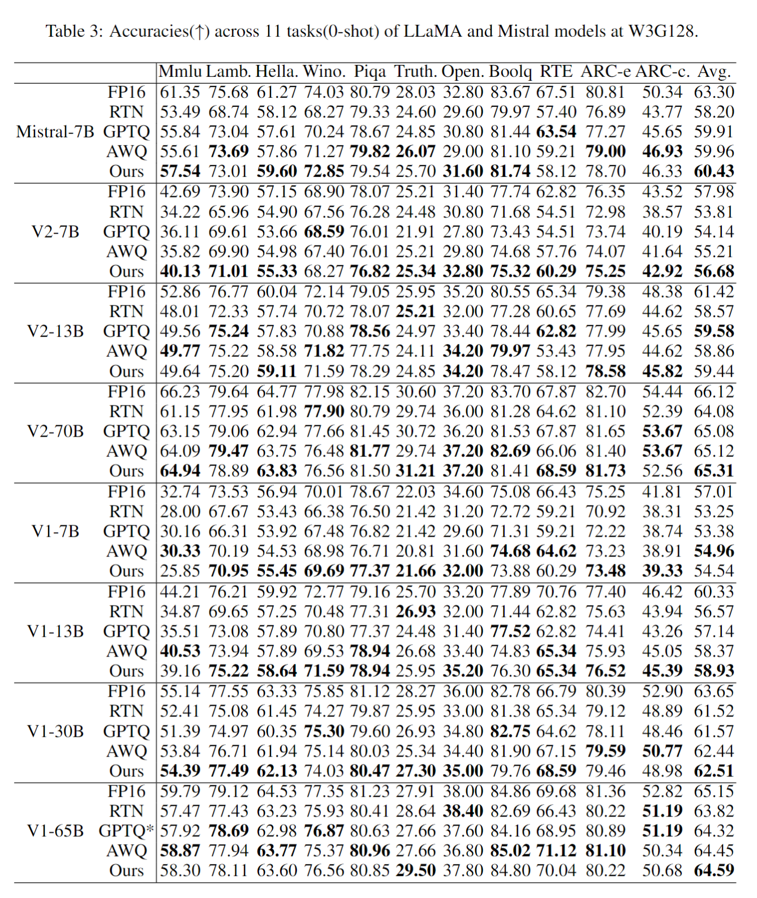

# AutoRound: Advanced Weight-Only Quantization Algorithm for a Broad Range of LLM Models

AutoRound is an advanced weight-only quantization algorithm, based on SignRound. It's tailored for a wide range of models and consistently delivers noticeable improvements, often significantly outperforming SignRound. However, it comes at the cost of approximately 2.5 times the tuning runtime.

## Prerequisites
- Python 3.9 or higher


- The transformers version required varies across different types of models. Here, the transformers version used for running models during experiments is provided as a reference.
    | Model | Transformers version |
    |  :----: | :----: |
    | EleutherAI/gpt-j-6b | 4.28/4.30/4.34/4.36 |
    | huggyllama/llama-7b | 4.28/4.30/4.34/4.36 |
    | meta-llama/Llama-2-7b-hf | 4.30/4.34/4.36 |
    | facebook/opt-6.7b | 4.28/4.30/4.34/4.36 |
    | tiiuae/falcon-7b | 4.28/4.30/4.34/4.36 |
    | mosaicml/mpt-7b | 4.28/4.30/4.34/4.36 |
    | bigscience/bloom-7b1 | 4.28/4.30/4.34/4.36 |
    | baichuan-inc/Baichuan-7B | 4.28/4.30 |
    | Qwen/Qwen-7B | 4.28/4.30/4.34/4.36 |
    | THUDM/chatglm3-6b | 4.34/4.36 |
    | mistralai/Mistral-7B-v0.1 | 4.34/4.36 |
    
Please note that all experiments in the SignRound+ technical report were conducted using transformers version 4.34.1.


## Installation
Install the necessary dependencies with the following command:
```bash
pip install -r requirements.txt
```

## Usage
cd to examples folder, install lm-eval to run the evaluation
```bash
pip install -r requirements.txt
```

- **Default Settings:**
```bash
CUDA_VISIBLE_DEVICES=0 python3 main.py --model_name facebook/opt-125m --amp --num_bits 4 --group_size -1 --enable_minmax_tuning --use_quant_input
```
- **Reduced GPU Memory Usage and Adjusted Training Batch Size:**
```bash
CUDA_VISIBLE_DEVICES=0 python3 main.py --model_name facebook/opt-125m --amp --num_bits 4 --group_size -1 --low_gpu_mem_usage --train_bs 1 --gradient_accumulate_steps 8
```
- **Utilizing the AdamW Optimizer:**
Include the flag `--adam`. Note that AdamW may be  less effective than Sign gradient descent in many scenarios.

- **Running the Original SignRound:**
```bash
CUDA_VISIBLE_DEVICES=0 python3 main.py --model_name facebook/opt-125m --amp --num_bits 4 --group_size -1 --iters 400 --lr 0.0025 --minmax_lr 0.0025
```
 `--enable_minmax_tuning` is strongly recommended 


## Tips
Consider increasing tuning steps and adjusting the learning rate based on a scaling law to achieve better results, albeit with increased tuning time. For instance, at step 800, a learning rate of 0.00125 could be employed.


## Known Issues
Auto Rounding may encounter random issues with Qwen models.

ChatGlm-V1 is not supported

We are working on exporting the quantized model to HF format

Cpu kernel will be supported soon

## Validated Models
For a fair comparison, we utilized 512 samples from Pile-10k for all methods during calibration. Due to memory constraints, we maintained the original sequence length of 512 for AWQ, while for GPTQ and our approach,  a sequence length of 2048 is used. The notation GPTQ* indicates that we adjusted the random seed or data preprocessing to address issues related to the in-positive Hessian matrix or other issues.




Mistral-7b  done

LLaMAV1 done

LLaMAv2 done

LaMini-GPT-124M done

QWEN1-8B done,but has random issue

OPT-125M done

Bloom-560 smoke test done

falcon-7b smoke test done

gpt-leo-125m smoke test done

stablelm-base-alpha-3b smoke test done

dolly-v2-3b smoke test done

mpt-7b smoke test done

gpt-j-6b smoke test done

chatglm2-6b smoke test done

mixstral-7Bx8 smoke test done

## Reference
If you find SignRound useful for your research, please cite our paper:
```bash
@article{cheng2023optimize,
  title={Optimize Weight Rounding via Signed Gradient Descent for the Quantization of LLMs},
  author={Cheng, Wenhua and Zhang, Weiwei and Shen, Haihao and Cai, Yiyang and He, Xin and Lv, Kaokao},
  journal={arXiv preprint arXiv:2309.05516},
  year={2023}
}
```


